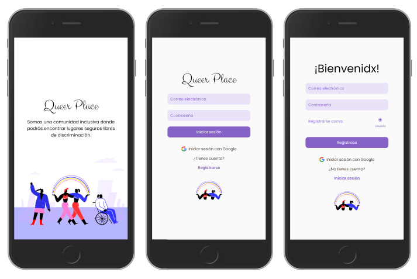
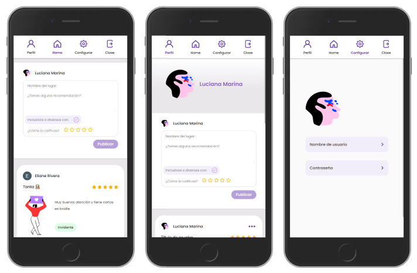

## Índice

* [1. Estudio de usuario](#1-estudio-de-usuario)
* [2. Historias de usuario](#2-historias-de-usuario)
* [3. Diseño de la interfaz de usuario](#3-diseno-de-la-interfaz-de-usuario)
* [4. Tecnologías empleadas](#4-tecnologías-empleadas)
* [5. Producto final](#5-producto-final)
* [6. Creadoras](#6-creadoras)

 
 

<h1 align="center" style="color:#8662c7 ">Queer Place</h1>

Queer Place es una red social que tiene como enfoque crear una comunidad inclusiva y libre de discriminación donde los usuarios puedan brindar y encontrar, por medio de publicaciones, recomendaciones acerca de lugares y servicios con las características mencionadas.

    

## 1. Estudio de usuario

a) ¿Quiénes son los principales usuarios?
Los principales usuarios son aquellas personas que buscan una comunidad segura donde encontrar recomendaciones.
Las edades de estas personas oscilan entre 18 y 30 años.

b) ¿Cuáles son los objetivos de estos usuarios en relación con el producto?
*	Encontrar información que difunda lugares y servicios inclusivos.
*	Iniciar sesión con Gmail o correo electrónico.
*	 Poder publicar opiniones y calificar sus experiencias.
*	Poder dar like, editar y eliminar un post
*	Poder acceder a esta red social por medio del celular y no solo desde la pc o laptop.

c) ¿Cuáles son las secciones más relevantes que quieren ver en la red social?
*	Sección de publicaciones
*	Edición de perfil
*	Perfil de usuario

d) ¿Cuándo utilizan o utilizarían el producto?
*	Cuando tengan la necesidad de investigar acerca de la experiencia vivida en algún lugar o con algún servicio. Por otro lado, el dispositivo donde más la usarían, sería el teléfono móvil.

## 2. Historias de usuario

| Historias de usuario | Detalle |
| --- | --- |
| HU 1 | Como usuario, quiero una red social para difundir y/o recomendar espacios seguros y libres de discriminación. |
| HU 2 | Como usuario, quiero poder registrarme para ingresar a la red social. |
| HU 3 | Como usuario, quiero una red social armoniosa para evitar el ruido visual. |
| HU 4 | Como usuario, quiero un interfaz ordenada e intuitiva para tener una mejor experiencia durante la navegación. |
| HU 5 | Como usuario, quiero editar mis recomendaciones y poder corregir una publicación específica. |
| HU 6 | Como usuario, quiero poder indicar que me gusta una publicación mediante un botón like. |

## 3. Diseño de la interfaz de usuario

En base a los resultados obtenidos, diseñamos los siguientes prototipos:

### Celular

Bienvenida - Iniciar sesión - Registrar

 

Publicaciones - Perfil - Actualizar

 

### Laptop

Bienvenida - Iniciar sesión - Registarse

 

Publicaciones - Perfil - Actualizar

 

## 4. Tecnologías empleadas

*	HTML
*	CSS
*	JavaScript
*	Figma
*	Firebase
*	Eslint
*	Jest

## 5. Producto final

### Celular

Bienvenida - Iniciar sesión - Registrarse

 

Publicaciones - Perfil - Actualizar

 

### Laptop

Bienvenida - Iniciar sesión - Registrarse

 

Publicaciones - Perfil - Actualizar

 

## 6. Creadoras

* [Valeria Pizarro](https://github.com/ValPizarro)
* [Eliane Rivera](https://github.com/ElianeRiveraCastillo22)
* [Dolly Ochoa](https://github.com/DollyPilar)
